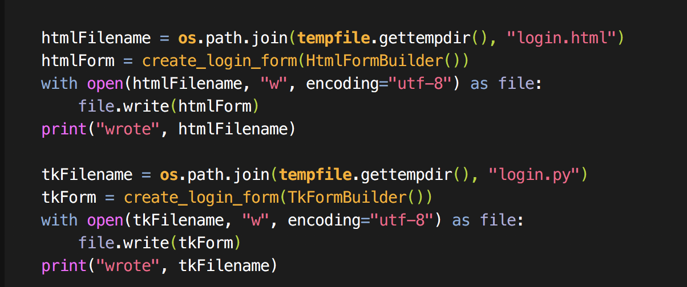
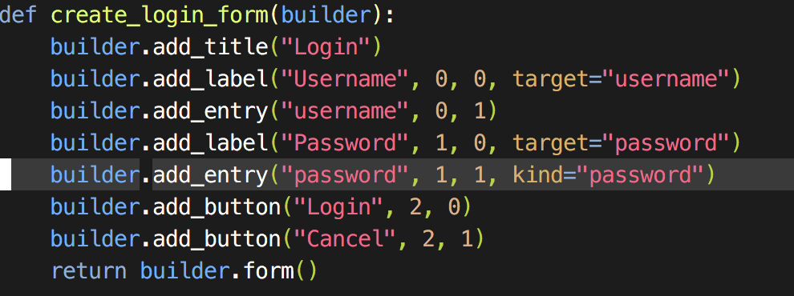
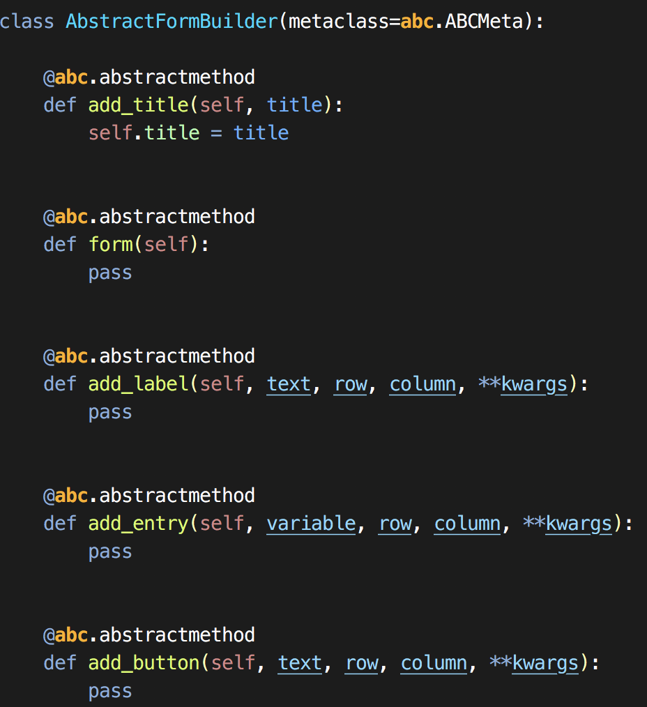

## 2. 빌더 패턴

***

* 빌더 패턴은 다른 객체를 조합한 복합 객체 (compled object)를 생성하기 위해 고안됐다는 점에서 추상 팩터리 패턴과 비슷하다.
* 빌더 패턴은 복합 객체를 구축하는 메서드를 제공할뿐더러 전에 복합 객체 자체의 표현을 보유한다는 점에서 팩터리와 구별된다.
* 이 패턴은 **복합 객체**가 하나 또는 여러 개의 더 간단한 객체로부터 만들어진다는 점에서 추상 팩터리 패턴과 동일한 조합 방법을 제공한다.
* 그러나 이 패턴은 특히 복합 객체의 표현을 조합 알고리즘과 별도로 유지해야 할 때 적합하다.

***

가장먼저 최상위 코드

* 각 폼을 생성한 후 파일에 저장
* 두 경우 모두 동일한 생성함수 `create_login_form()` 에 적절한 빌더 객체를 인자로 전달해 호출

***

* `create_login_form()`함수는 임의의 HTML이나 Tkinter 폼을 생성할 수 있다. 또는 알맞은 빌더만 있다면 어떤 종류의 폼이든 생성 가능하다.

***

HtmlFormBuilder와 TkFormBuilder 모두 추상 기반 클래스인 AbstractFormBuilder를 상속한다.

* 이 클래스를 상속하는 클래스는 추상 메서드를 모두 구현해야 한다.
* 참고로 `AbstractFormBuilder`는 `abs.ABCMeta` 메타클래스를 받아 abs 모듈의 @abstractmethod 데코레이터를 사용한다
