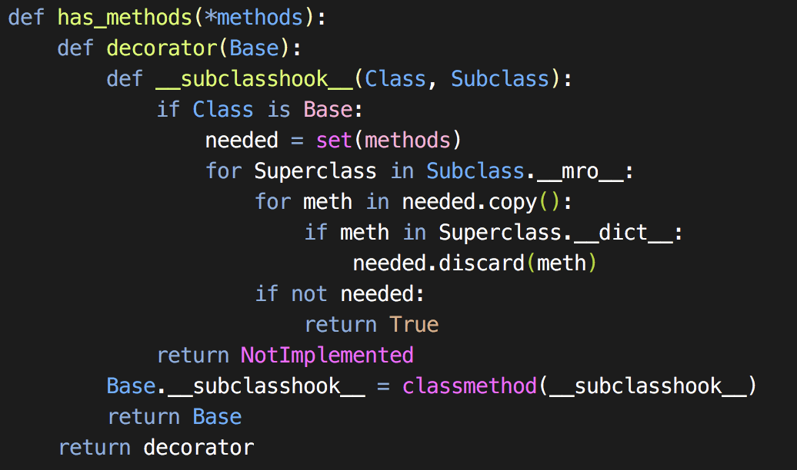
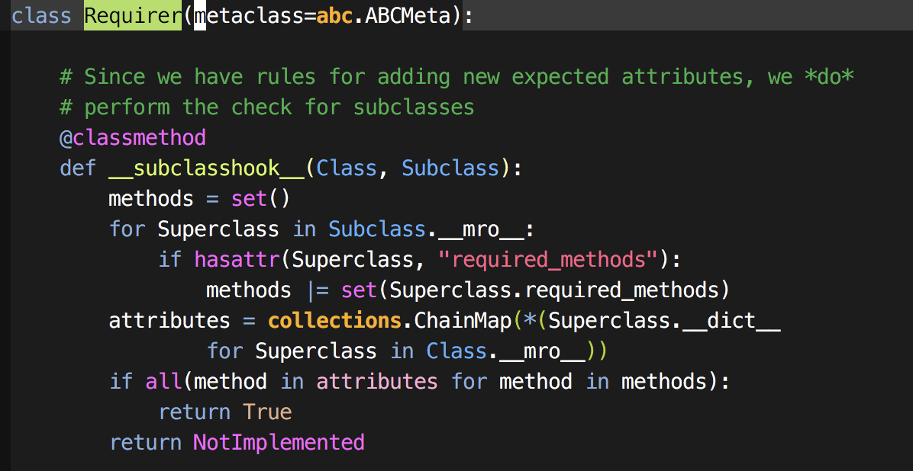
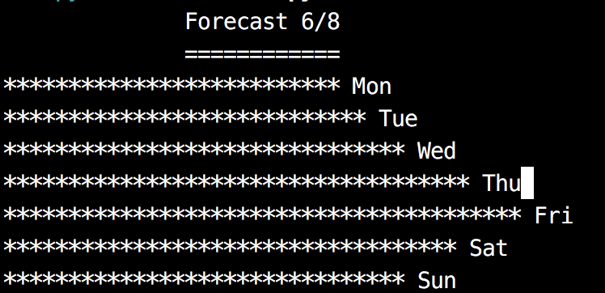
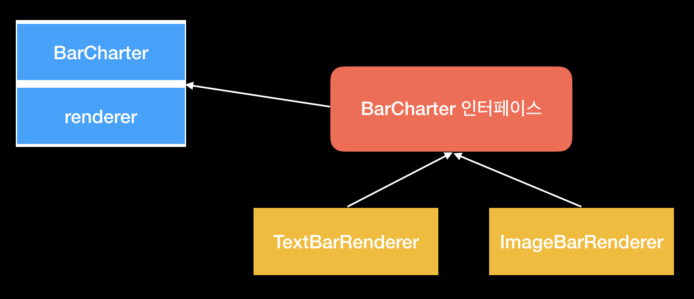
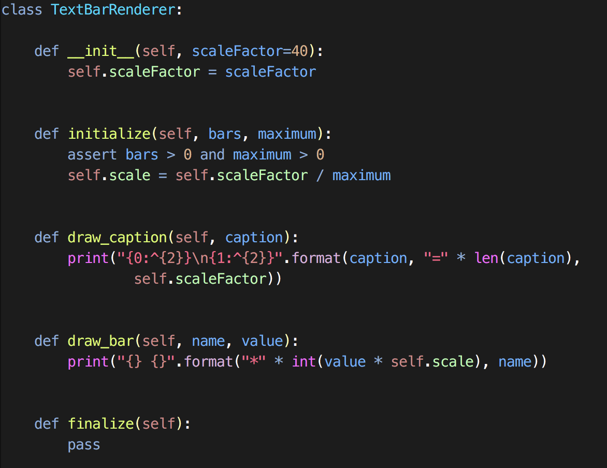
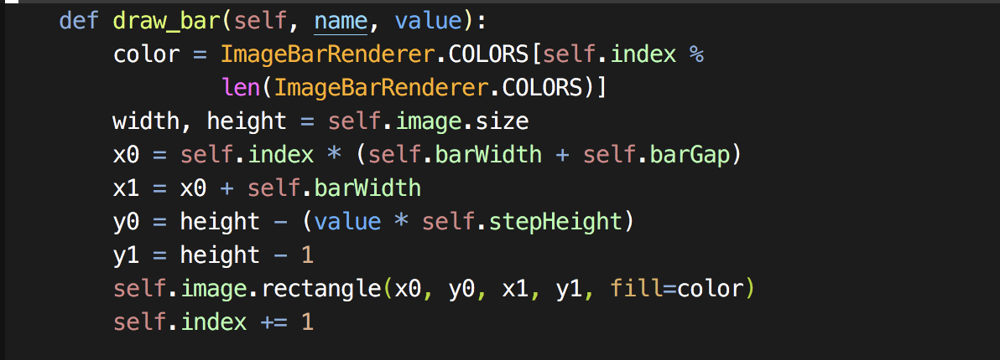

## 2. 브리지 패턴

* 브리지 패턴은 추상화(인터페이스 또는 알고리즘)와 구체적인 구현을 별도로 구분해야 하는 상황에서 활용
* 브리지 패턴을 **활용하지 않은** 접근법
  - 하나 이상의 추상 기반 클래스를 만들고
  - 각 기반 클래스마다 둘 이상의 구체적인 구현 클래스를 제공
* 브리지 패턴을 **활용 하는** 경우
  - 두 개의 독립적인 클래스 계층을 둔다
    - 기능(인터페이스와 고수준 알고리즘)을 정의하는 **"추상"** 클래스 계층
    - 추상적 기능이 결국 실행할 구현 코드를 제공하는 **"구상"** 클래스 계층
  - **추상**클래스는 **구상**클래스의 인스턴스 가운데 하나와 합성
    - 이 인스턴스는 추상적 인터페이스와 구체적 기능사이의 **다리** 역할을 한다.
* 앞에서 살펴본 어댑터 패턴에서 `HtmlRenderer`클래스는 브리지 패턴을 활용했다고도 할 수 있다. 그리기 기능을 제공하기 위해 `HtmlWriter`를 합성했기 깨문

---

* 이번 예제로는 측정 알고리즘을 활용해 막대그래프를 그리는 클래스를 생성하되, 실제 그래프를 그리는 기능은 다른 클래스가 담당하게 한다고 하자.

* `BarCharter`클래스에 막대 그래프를 그리는 알고리즘을 구현하되 (`render()` 메서드에), 그리기 자체는 이를 위해 구현한 객체에 의존
* 이 객체는 특별한 막대 그래프 그리기 인터페이스를 따라야 한다.
  - 이 인터페이스에 필요한 메서드로는 `initialize(int, int)`, `draw_caption(str)`, `draw_bar(str, int)`, `finalize()`가 있다

---

* 이전 절과 마찬가지로 `isinstance()` 테스트를 활용해 전달된 `renderer` 객체가 우리가 필요로 하는 인터페이스를 지원하는지 확인하는 동시에 그리기 클래스가 어떤 특별한 기반 클래스를 상속하는지는 않아도 되게 할 것
* 이번 인터페이스 검사 클래스는 앞에서 처럼 10줄 정도의 클래스를 생성하는 대신 단 두줄의 코드를 생성

* 위 코드는 abc 모듈과 함께 동작하는데 필요한 메타클래스를 가진 `BarRenderer` 클래스를 생성
* 이 클래스는 `Qtrac.has_method()` 함수에 전달
* 이 함수는 클래스 데코레이터를 반환
* 데코레이터는 `__subclasshook__()` 클래스 메서드를 클래스에 추가
* 이 새로운 메서드는 `BarRenderer`가 `isinstance()` 호출의 인자로 전달될 때마다 지정된 메서드가 있는지 검사 (클래스 데코레이터는 2장 4절 에서 설명)

* `Qtrac.py` 모듈의 `has_methods()` 함수는 필요한 메서드를 포착해 클래스 데코레이터 함수를 생성한 다름 이 함수를 반환
- 데코레이터 자체는 `__subclasshook__()` 함수를 생성한 다음, 이를 내장 함수인 `classmethod()`를 통해 기바느 클래스에 클래스 메서드로 추가한다.
- `__subclasshook__()`함수는 본질적으로 어댑터 패턴에서 논의한 바와 같다
- 다만 이번에는 기반클래스를 하드코딩하는 대신 데코레이션 대상 클래스(Base)를 사용하고, 하드코딩한 메서드 이름 집합 대신 데코레이터에 전달된 메서드 이름들(methods)을 사용한다

---

- 제네릭 추상 기반 클래스를 상속하는 식으로 동일한 메서드 검사 기능을 수행하는 것도 가능

- `Qtrac.py`에 있는 `Qtrac.Requirer` 클래스는 `@has_methods` 클래스 데코레이터를 통해 동일한 검사 기능을 수행하는 추상 기반 클래스다.

---

- 이 `main()` 함수에서는 출력할 데이터를 성정한 다음 각각 다른 구현 방법을 활용하는 두 종류의 막대 그래프 그리기 객체를 생성한 이후
- 이를 활용해 막대 그래프를 그린다.

---
- text barchart

- image barchart

- 막대그래프 그리기 인터페이스 및 클래스

---

- 이 클래스에서는 텍스트로 `sys.stdout`에 출력하는 막대 그래프 그리기 인터페이스를 **구현** 한다.
- 참고로 이 클래스에서 `finalize()` 메서드는 아무것도 하지 않는다. 하지만 막대 그래프 그리기 인터페이스를 만족하려면 반드시 있어야 한다.

---
---

- `barchart1.py`에서 `ImageBarRenderer` 클래스는 cyImage 모듈을 활용한다.......

- Image 모듈은 픽셀 하나를 알파(투명도), 빨강, 초록, 파랑의 네가지 색상 요소로 인코딩한 부호없는 32비트 정수로 표현한다.
- 이 모듈은 색 이름을 받아 그에 해당하는 부호 없는 정수값을 반환하는 `Image.color_for_name()` 메서드를 제공
  - 이 때 색 이름으로는 X11의 rgb.txt에 있는 이름 (ex: "sienna") 이나 HTML 스타일 이름 (ex: "#A0522D") 중 하나를 쓸 수 있다.
- 위 코드에서는 막대 그래프의 막대에 쓰일 색 리스트를 만들었다.

---

- 이 메서드를 통해 사용자가 원하는 대로 몇가지 값을 설정할 수 있으며, 이에 따라 막대 그래프의 모양이 바뀐다.

---

- 이 메서드와 이후 메서드들은 막대 그래프 그리기 인터페이스의 일부이므로 반드시 있어야 한다. (`initialize()`, `draw_caption()`, `draw_bar()`, `finalize()`)
- `initialize()` 메서드에서는 크기가 막대 개수, 폭과 최대 높이에 비례하고, 기본색은 흰색인 새 이미지를 생성한다.
- `self.index` 변수는 0부터 시작해 몇 번째 막대를 그려야 할지 파악하는데 활용

---

- Image 모듈은 텍스트 그리기를 지원하지 않으므로 caption 값은 이미지 파일명으로 사용

---

- 이 메서드는 사용할 색을 `COLORS`에서 선책한다
- 다음으로 현재 (`self.index`) 막대의 좌표(왼쪽 상단과 오른쪽 하단)를 계산하고 `self.image` 인스턴스(`Image.Image` 타입의)에게 지정된 좌표에 사각형을 color의 색으로 채워서 그리도록 요청
- 그다음 인덱스를 하나 증가시켜 다음막대를 그리게 한다.

---

- 여기서는 간단히 이미지를 저장하고 그 사실을 사용자에게 콘솔 메시지로 알려준다.

---

- 분명 `TextBarRenderer`와 `ImageBarRenderer`의 구현 방법은 서로 극단적으로 다르다
- 하지만 두 클래스 모두 브리지를 활용해 `BarCharter` 클래스에 실제 막대 그래프 그리기 기능을 제공할 수 있다.
